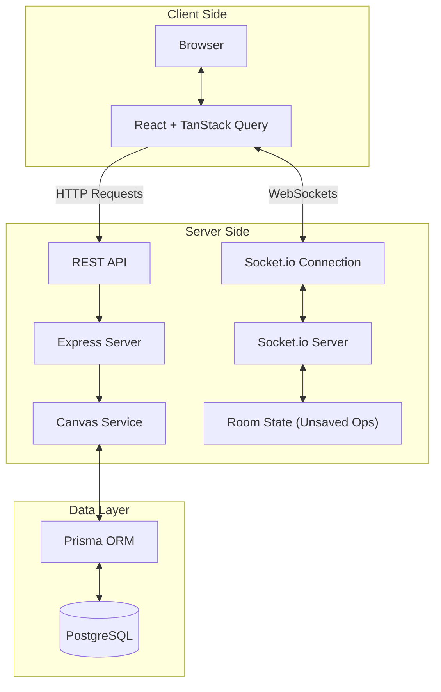
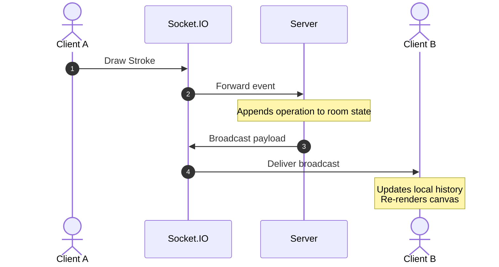
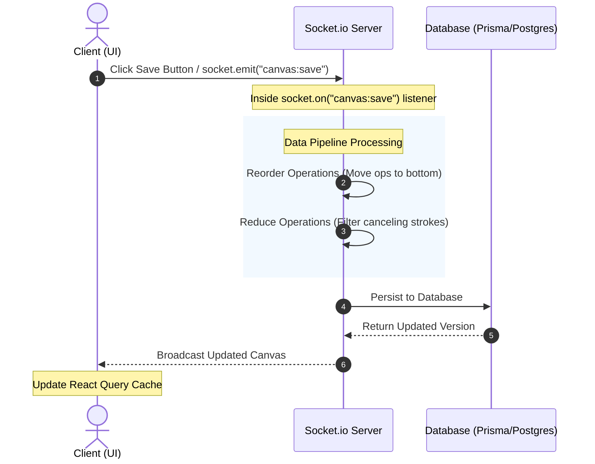

# SketchPals

A server-authoritative, real-time collaborative drawing application built with React, Node.js, PostgreSQL, Prisma, and Socket.IO.

> **Live Demo:** https://sketchpals.uk
> **Frontend:** React + TypeScript
> **Backend:** Express + Socket.IO + Prisma
> **Database:** PostgreSQL
> **Deployment:** Docker, Nginx, GitHub Actions, VPS

---

## About

SketchPals is a real-time collaborative drawing application where multiple users can draw, erase, move strokes, and collaborate on the same canvas simultaneously.

Rather than focusing solely on drawing features, this project explores the engineering challenges behind building collaborative software. It uses a server-authoritative architecture, operation-based synchronization, and real-time communication to keep every participant synchronized while maintaining consistency between persisted and live state.

The project also demonstrates modern full-stack development practices including authentication, authorization, containerized deployment, automated CI/CD, and real-time systems.

This project was built as a portfolio project to explore the design and implementation of real-time collaborative systems.

---

## Features

### Collaboration

- Real-time drawing
- Live stroke synchronization
- Join existing collaboration sessions
- Automatic room synchronization
- Server-authoritative room state

### Canvas

- Freehand drawing
- Eraser
- Move strokes
- Undo / Redo
- Persistent canvas saving
- Automatic thumbnail generation

### Authentication & Permissions

- Google OAuth
- Protected routes
- Canvas sharing
- Role-based permissions
- Owner / Collaborator access control

## Infrastructure

- Dockerized application
- Nginx reverse proxy
- GitHub Actions CI/CD
- VPS deployment
- PostgreSQL database

---

## Architecture



---

### Real-time Synchronization



---

### Save Pipeline



---

## Engineering Decisions

### Server-Authoritative Synchronization

The server owns all unsaved canvas operations. Clients only generate operations and submit them to the server. This ensures that every collaborator receives a consistent view of the canvas and allows new participants to synchronize with the latest live state when joining a room.

### Operation-Based Persistence

Instead of transmitting the entire canvas on every save, the client sends drawing operations (draw, erase, move). The server optimizes these operations by removing canceling operations before persisting them, significantly reducing network payloads and unnecessary database work.

### Hydration Strategy

When joining a canvas, the client combines persisted data from the database with the room's live unsaved operations before rendering. This prevents visual inconsistencies and ensures newly connected users immediately see the latest collaborative state.

### React Query

React Query manages cached server data while the canvas itself maintains an interactive local editing history. Socket events update the cache after saves so every client remains synchronized without unnecessary refetches.

---

## Tech Stack

### Frontend

- React
- TypeScript
- TanStack Query
- Socket.IO Client

### Backend

- Node.js
- Express
- Socket.IO
- Prisma ORM

### Database

- PostgreSQL

---

## Running locally

**Clone the repository:**

```bash
git clone https://github.com/x3rD1/SketchPals.git
```

**Navigate to the project directory:**

```bash
cd SketchPals
```

**Initialize postgres container:**

```bash
docker compose -f docker-compose.dev.yml up
```

**Setting up frontend dev environment:**

```bash
cd frontend
npm ci
cp .env.example .env
code .env
```

**Setting up backend dev environment:**

```bash
cd .. && cd backend
npm ci
cp .env.example .env
code .env
```

**Finally run locally:**

Terminal 1 - Backend

```bash
cd backend
npm run dev
```

Terminal 2 - Frontend

```bash
cd frontend
npm run dev
```

Then open http://localhost:5173 in your browser.

---

## Future Improvements

- Shapes
- Text tool
- Live cursors
- Mobile drawing support
- Better conflict resolution
